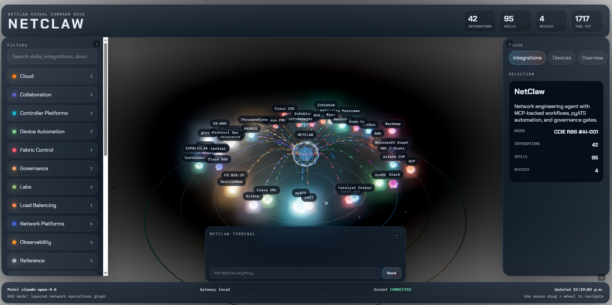

<p align="center">
  
</p>

# NetGeniusClaw Visual HUD

A Three.js 3D network operations dashboard for [NetGeniusClaw](https://github.com/automateyournetwork/netclaw). Visualizes all 43 MCP servers, 179 skills, your device fleet, and live BGP peering topology in a real-time interactive scene. Includes a chat terminal wired directly to the OpenClaw gateway for live tool execution from the browser. Supports bidirectional Slack and WebEx channels.

---

## Table of Contents

1. [Build and Install NetGeniusClaw](#1-build-and-install-netclaw)
2. [Start the OpenClaw Gateway](#2-start-the-openclaw-gateway)
3. [Local BGP Peering (Optional)](#3-local-bgp-peering-optional)
4. [Peer with Other NetClaws (Optional)](#4-peer-with-other-netclaws-optional)
5. [Start the Visual HUD](#5-start-the-visual-hud)
6. [Using the HUD](#6-using-the-hud)
7. [Reading the Org Chart](#7-reading-the-org-chart)
8. [Architecture](#architecture)
8. [API Reference](#api-reference)
9. [Troubleshooting](#troubleshooting)

---

## 1. Build and Install NetGeniusClaw

Before running the HUD, you need a working NetGeniusClaw installation with the OpenClaw gateway configured.

### Prerequisites

- **Node.js** 18+ and npm
- **Python** 3.10+
- **OpenClaw** CLI (`pip install openclaw` or via the install script)

### Clone and Install

```bash
git clone https://github.com/automateyournetwork/netclaw.git
cd netgeniusclaw
./scripts/install.sh
```

The installer runs two setup phases:

**Phase 1: `openclaw onboard`** (OpenClaw's built-in wizard)
- Pick your AI provider (Anthropic, OpenAI, Bedrock, Vertex, 30+ options)
- Set up the gateway (local mode, auth, port)
- Connect channels (Slack, WebEx, Discord, Telegram, etc.)
- Install the daemon service

**Phase 2: `./scripts/setup.sh`** (NetGeniusClaw platform credentials)
- Network devices (testbed.yaml editor)
- Platform credentials (pyATS, NetBox, ACI, ISE, ServiceNow, GitHub, Meraki, etc.)
- Your identity (name, role, timezone for USER.md)

### Configuration Files

After setup, your configuration lives in:

| Path | Purpose |
|------|---------|
| `~/.openclaw/openclaw.json` | Gateway config — auth token, port, channels |
| `~/.openclaw/.env` | All integration credentials and API keys |
| `netgeniusclaw/testbed/testbed.yaml` | Device inventory for pyATS |
| `netgeniusclaw/IDENTITY.md` | NetGeniusClaw identity, ASN, creature type |
| `netgeniusclaw/SOUL.md` | Agent personality and operating instructions |

Reconfigure anytime:
- `openclaw configure` — AI provider, gateway, channels
- `./scripts/setup.sh` — network platform credentials

---

## 2. Enable Chat Completions and Start the OpenClaw Gateway

The Visual HUD and Canvas Chat proxy messages through OpenClaw's
OpenAI-compatible chat-completions endpoint. Enable that endpoint once, then
start the gateway in a dedicated terminal:

```bash
cd netgeniusclaw
openclaw config set gateway.http.endpoints.chatCompletions.enabled true
openclaw gateway run
```

If the gateway was already running when you changed the setting, restart it.

You should see:

```
[gateway] listening on ws://127.0.0.1:18789
[gateway] agent model: anthropic/claude-sonnet-4-6
```

The gateway must be running for live chat responses and tool execution (Slack messages, GitHub issues, ServiceNow tickets, mind maps, etc.). Without it, the chat falls back to a local heuristic that identifies which integrations and devices are relevant but cannot execute tools.

The chat interfaces report whether the gateway is ready for chat. A reachable
gateway whose chat-completions endpoint is disabled is shown separately from a
fully offline gateway.

---

## 3. Local BGP Peering (Optional)

NetGeniusClaw includes a pure-Python BGP daemon (AS 65001) and a Docker-based FRR router lab. When running, the HUD automatically discovers BGP peers and renders them as equal core nodes alongside the local NetGeniusClaw in the 3D scene.

### A. Start the FRR Router Lab

The lab creates three FRR routers (Edge1, Core route reflector, Edge2) in AS 65000 with OSPF + iBGP, connected to your host via a GRE tunnel.

```bash
cd netgeniusclaw/lab/frr-testbed
docker compose up -d
sleep 15                          # wait for OSPF/BGP convergence
sudo bash scripts/setup-gre.sh   # create GRE tunnel from host to Edge1
bash scripts/verify.sh            # confirm everything is up
```

```
Topology:

NetGeniusClaw (AS 65001)     Edge1 (AS 65000)     Core (RR)     Edge2 (AS 65000)
  host / WSL           1.1.1.1              2.2.2.2       3.3.3.3
  172.16.0.2 ──GRE──── 172.16.0.1
                       eBGP ↔ NetGeniusClaw       iBGP hub      iBGP spoke
```

### B. Start the BGP Daemon

```bash
cd netgeniusclaw/mcp-servers/protocol-mcp
pip install -r requirements.txt

export NETCLAW_ROUTER_ID="4.4.4.4"
export NETCLAW_LOCAL_AS="65001"
export NETCLAW_BGP_PEERS='[{"address":"172.16.0.1","remote_as":65000}]'

python bgp-daemon-v2.py
```

The daemon exposes an HTTP API on `localhost:8179`:

| Endpoint | Method | Description |
|----------|--------|-------------|
| `/peers` | GET | BGP peer state (ASN, router-id, state, timers) |
| `/rib` | GET | Full RIB (Adj-RIB-In from all peers) |
| `/status` | GET | Daemon status and uptime |
| `/inject` | POST | Inject a route: `{"network":"10.99.99.0/24","next_hop":"172.16.0.2"}` |
| `/withdraw` | POST | Withdraw a route: `{"network":"10.99.99.0/24"}` |

### C. Verify Peering

```bash
# Check peering is Established
curl -s http://localhost:8179/peers | python3 -m json.tool

# Check received routes
curl -s http://localhost:8179/rib | python3 -m json.tool
```

### D. Teardown

```bash
sudo bash scripts/teardown-gre.sh
docker compose down
```

---

## 4. Peer with Other NetClaws (Optional)

Multiple NetGeniusClaw instances can peer with each other over BGP. Each NetGeniusClaw runs its own BGP daemon with a unique AS number. When peered, both HUDs show each other as core nodes with routes fanning out as dendrite wires.

### Remote Peering via ngrok

On the remote NetGeniusClaw host, expose the BGP port:

```bash
ngrok tcp 179
```

On the local NetGeniusClaw, add the ngrok endpoint as a BGP peer:

```bash
export NETCLAW_BGP_PEERS='[
  {"address":"172.16.0.1","remote_as":65000},
  {"address":"X.tcp.ngrok.io","remote_as":65002,"remote_port":NNNNN}
]'
python bgp-daemon-v2.py
```

### Direct Peering

If both NetClaws are on the same network or have direct IP connectivity:

```bash
export NETCLAW_BGP_PEERS='[
  {"address":"172.16.0.1","remote_as":65000},
  {"address":"192.168.1.50","remote_as":65002}
]'
python bgp-daemon-v2.py
```

The HUD renders all BGP peers as equal core nodes in a triangular layout — local NetGeniusClaw on the left, peer nodes on the right — each with its received routes displayed as animated dendrite wires.

---

## 5. Start the Visual HUD

### Install Dependencies

```bash
cd netgeniusclaw/ui/netclaw-visual
npm install
```

### Development Mode

```bash
npm run dev
```

This starts two processes concurrently:

| Process | Port | Purpose |
|---------|------|---------|
| **API Server** | 3001 | REST API + WebSocket for graph data, BGP state, chat proxy, device config |
| **Vite Dev Server** | 3000 | Three.js frontend with hot reload, proxies `/api` and `/ws` to port 3001 |

Open **http://localhost:3000** in your browser. The default route remains the
3D Visual HUD; the alternative branching chat workspace is available at
**http://localhost:3000/canvas.html**.

### Production Build

```bash
npm run build
npm run preview
```

### What You Need Running

| Component | Required | Command | Purpose |
|-----------|----------|---------|---------|
| **HUD** | Yes | `npm run dev` | The dashboard itself |
| **OpenClaw Gateway** | For live chat | `openclaw gateway run` | AI-powered tool execution |
| **BGP Daemon** | For topology | `python bgp-daemon-v2.py` | BGP peer discovery + routes |
| **FRR Lab** | For router peering | `docker compose up -d` | Lab routers to peer with |

---

## 6. Using the HUD

### The 3D Scene

The center of the HUD is a Three.js 3D scene. Use your mouse to navigate:

| Action | Control |
|--------|---------|
| **Orbit** | Click and drag |
| **Zoom** | Scroll wheel |
| **Select node** | Click on a node |
| **Deselect** | Click the local NetGeniusClaw core or empty space |

### Core Nodes

The scene displays up to three central core nodes in a triangular arrangement:

- **NetGeniusClaw (Local)** — your local instance, with all 43 integrations orbiting around it as colored spheres connected by animated data-flow tubes
- **Peer NetGeniusClaw** — another NetGeniusClaw instance you're peered with via BGP (magenta tint), with received routes fanning out as dendrite wires
- **Router** — a traditional router peer like FRR Edge1 (cyan tint), also showing its advertised routes

All core nodes have the same visual treatment: icosahedron shell, glowing nucleus, rotating torus rings, and a label. Magenta tubes connect the cores to show BGP peering links.

### Integration Nodes

Each of the 43 MCP integrations is rendered as a sphere orbiting the local core, color-coded by category:

| Color | Categories |
|-------|-----------|
| Cyan | Cloud, Device Automation |
| Green | Source of Truth, Governance |
| Orange | Security, Fabric Control |
| Magenta | Observability, Network Platforms |
| Yellow | Labs, Visualization |
| White | Reference, Utilities |

Click any integration node to see its skills, estimated tool count, and configuration status in the right sidebar detail panel.

### Device Nodes

Devices from your `testbed.yaml` appear as smaller nodes connected to the local core. Click a device to see its hostname, OS, platform, IP, and connection details.

### Chat Terminal

The chat drawer in the bottom-right corner connects directly to the OpenClaw gateway:

1. Type a message like `check R1 interfaces make a github report and send a slack message` or `send a WebEx alert about R2 CPU`
2. The HUD identifies which integrations are relevant (pyATS, GitHub, Slack, WebEx) and lights them up in the 3D scene
3. Animated beams fire from the local core to each activated integration
4. The gateway executes the actual tools (runs pyATS commands, creates GitHub issues, sends Slack messages)
5. The response appears in the chat with a **LIVE** badge

If the gateway is offline, responses fall back to a local heuristic with a **LOCAL** badge that identifies relevant integrations and devices but cannot execute tools.

The chat header shows:

- **LIVE** (green) — the gateway and chat-completions endpoint are ready
- **CHAT API DISABLED** (orange) — the gateway is reachable, but its
  chat-completions endpoint must be enabled
- **OFFLINE** (orange) — the gateway is not running or is unreachable

### Canvas Chat (Alternative Interface)

Select **Canvas Chat** in the terminal header, or open `/canvas.html` directly,
to use NetGeniusClaw in a spatial, branching workspace. The canvas is an alternative
frontend only: it uses the same `/api/chat` proxy, OpenClaw gateway, configured
model, MCP integrations, skills, and safety controls as the existing terminal.

- Highlight part of an answer and branch it into a focused child conversation.
- Drag, resize, collapse, tile, or automatically tidy conversation windows.
- Select multiple branches and synthesize their context into a new node.
- Attach images or text/code/data files to a turn.
- Keep multiple canvas sessions in browser-local IndexedDB and export/import
  portable JSON when needed.
- Return to the standard NetGeniusClaw interface at any time with the **Visual HUD**
  button in the canvas header.

Each canvas request sends the context for its own branch. Sibling branches are
therefore isolated from one another, while the original `{ "message": "..." }`
chat request remains fully backward compatible for the Visual HUD.

### Top Bar Metrics

The header displays real-time counts:
- **Integrations** — number of configured MCP integrations
- **Skills** — total skills loaded from workspace/skills/
- **Devices** — devices in your testbed.yaml
- **Tool Est.** — estimated total tools across all integrations

### Left Sidebar — Filters

- **Search** — filter integrations and devices by name
- **Category toggles** — show/hide integration groups (Cloud, Security, Governance, etc.)
- **Settings** — view and edit integration configuration

### Right Sidebar — Detail Panel

Three focus tabs at the top:
- **Integrations** — list of all integrations, click to inspect
- **Devices** — list of all testbed devices, click to inspect
- **Overview** — summary of all core nodes, BGP state, and route counts

The detail panel below shows context for the selected node:
- **Integration selected**: skills, tools, config status, category
- **Device selected**: hostname, OS, platform, IP, credentials status
- **Peer core selected**: ASN, router-id, BGP state, Adj-RIB-In route table with prefix, next-hop, and AS path

### Footer — Status Bar

- **Model** — the AI model powering the gateway
- **Gateway** — gateway connection status
- **Socket** — WebSocket connection state (CONNECTED / RECONNECTING)
- **Updated** — timestamp of last data refresh

---

## 7. Reading the Org Chart

The HUD renders your NetGeniusClaw's **trust topology** as a top-down org chart. It
replaced an orbiting-cores scene in feature 072; the layout is planar and the
camera cannot rotate, because "external vs internal" only reads if the layout
and the viewer agree on which way is up.

### The three bands

```
  ══════ EXTERNAL — eN2N peers ══════      above the boundary: other orgs
  ─────── TRUST BOUNDARY ────────────      drawn explicitly, not implied
        [ BORDER ]   ╌╌► [ edges ]         you, plus mobile devices
  ─────── INTERNAL — iN2N members ────      your own claws, by category
```

Peers north of the boundary are **outside your organisation**. The Border is
you. Member claws fan out below, grouped into categories. Mobile edge devices
get their own lane beside the Border — inside the boundary, but not part of the
member chart, because a phone receives pushes rather than serving delegations.

### Claw health — four states

| | State | Meaning |
|---|---|---|
| ● | **Hot** | Running now |
| ◆ | **Warm** | Seen within 15 minutes; idle, not a fault |
| ▬ | **Cold** | Never started — inert **by design**, entirely normal |
| ◻ | **Fault** | Was reachable, no longer is — needs attention |

Cold and Fault are deliberately kept apart. Most claws are cold on purpose
(on-demand), so merging the two would bury a genuine fault inside a crowd of
healthy-but-idle ones. Fault is the most prominent state after Hot for exactly
that reason.

States differ in **shape, colour and motion at once**, never opacity alone, so
the encoding survives a greyscale screenshot and `prefers-reduced-motion`.

### Categories are derived, not configured

A member's category comes from the skills it holds, matched against the shipped
integration catalog (`server.js`, ~70 integrations across 22 categories). No
member names are hardcoded anywhere, so the chart works on a deployment it has
never seen. A claw whose skills match nothing lands in **Uncategorised** rather
than being dropped.

Categories are ordered by heat, then size — but **only once, at load**. Live
updates repaint; they never move anything. A claw that fails changes how it
looks, never where it is.

### Interacting

| Action | Result |
|---|---|
| **Click a claw** | Opens its detail panel *and* reveals its tools |
| **Drag** | Pans. Rotation is disabled by design |
| **Scroll** | Zooms |
| **Search** | Matches claws, categories and tool names — highlights in place, never hides or re-packs |
| **Tab / arrows** | Moves between and within bands |
| **Enter** | Selects |
| **`e`** | Expands tools without selecting |

Cold claws expand too: what a cold claw *would* bring is exactly what tells you
whether to warm it.

### Development

```bash
npm test                       # pure layout logic — no browser, no GPU
npm run dev                    # API :3001 + vite :3000
```

Load a fixture instead of live data — useful for an empty first-run view or the
100-member ceiling:

```
http://localhost:3000/?fixture=empty
http://localhost:3000/?fixture=scale-100
```

Fixtures live in `specs/072-hud-2-org-chart/fixtures/` and always render a
banner, so synthetic data can never be mistaken for your real Border.

Layout logic under `src/orgchart/` is pure — it imports nothing from three.js
and holds no DOM references, which is what lets it be unit tested. Rendering
lives in `src/orgchart-render/` and consumes that output without re-deriving it.
Keep that boundary; the test suite runs in bare Node and will fail if it breaks.

---

## Architecture

### Renderer stack

| Component | Version / choice | Notes |
|---|---|---|
| `three` | **0.185.1** | Bumped from `0.170.0` by spec 101. Fifteen releases; zero source changes were required, because every breaking change in r171–r185 lands in TSL / WebGPU node materials, which this HUD does not use. |
| Renderer | `WebGLRenderer` | **Not** `WebGPURenderer`. That migration is spec 102: `WebGPURenderer` supports neither raw-GLSL `ShaderMaterial` (this HUD has 4) nor `EffectComposer` (this HUD has a 7-pass chain), so it is an either/or rather than an upgrade. |
| Post-processing | `EffectComposer` | `RenderPass` → `UnrealBloomPass` → `ShaderPass`×2 (vignette, RGB-shift) → `AfterimagePass` → `FilmPass` → `GlitchPass` → `SMAAPass` → `OutputPass`. |
| Labels | `CSS2DRenderer` | DOM overlay, so labels stay crisp and selectable. |
| Camera | `OrbitControls`, zoom `0.35`–`6.0` | Constrained by spec 072 so the org-chart hierarchy always reads. |

`src/orgchart/` is **pure logic and must never import three.js**; `src/orgchart-render/`
owns every three.js contact. That split (spec 072) is what makes the layout, health
classification, liveness and staleness rules unit-testable — the render modules have no
automated coverage, so anything that can be a decision belongs on the pure side.

```
Browser (Visual HUD + Canvas Chat @ localhost:3000)
    |
    +-- GET  /api/graph          -> integrations, skills, devices, tool counts
    +-- GET  /api/bgp            -> BGP peers + RIB from daemon (localhost:8179)
    +-- GET  /api/gateway/status -> OpenClaw chat readiness check
    +-- POST /api/chat           -> linear message or branch context, proxied to OpenClaw
    +-- GET  /api/testbed/raw    -> read/edit testbed.yaml
    +-- PUT  /api/env            -> update integration credentials
    +-- WS   /ws                 -> real-time activations, BGP state, heartbeat
    |
    +-- API Server (Express @ localhost:3001)
    |     +-- Reads ~/.openclaw/ for gateway config and credentials
    |     +-- Reads workspace/skills/ for skill catalog
    |     +-- Reads testbed/testbed.yaml for device inventory
    |     +-- Polls BGP daemon at localhost:8179
    |
    +-- OpenClaw Gateway (@ localhost:18789)
          +-- Anthropic Claude (agent model)
          +-- 43 MCP integrations (pyATS, ACI, ISE, NetBox, GitHub, Slack, ...)
          +-- 179 skills (health checks, troubleshooting, auditing, ...)
```

---

## API Reference

| Endpoint | Method | Description |
|----------|--------|-------------|
| `/api/health` | GET | Health check |
| `/api/graph` | GET | Full integration + device graph for 3D visualization |
| `/api/bgp` | GET | BGP peer state and RIB from daemon |
| `/api/gateway/status` | GET | OpenClaw reachability and chat-completions readiness |
| `/api/skill/:skillId` | GET | Individual skill details |
| `/api/env/:integrationId` | GET | Integration environment variables |
| `/api/env` | PUT | Update integration credentials |
| `/api/testbed/raw` | GET | Read testbed.yaml |
| `/api/testbed/raw` | PUT | Update testbed.yaml |
| `/api/chat` | POST | Send `{ message }`, or `{ message, messages }` with branch-isolated context, to the OpenClaw gateway |
| `/api/chat/history` | GET | Chat message history |
| `/api/sessions` | GET | OpenClaw agent sessions |
| `/api/session/:id/tools` | GET | Tools used in a session |

---

## Troubleshooting

**Chat shows LOCAL instead of LIVE**
- Verify the gateway is running: `curl http://127.0.0.1:18789/v1/models`
- Check the gateway status indicator in the chat header (LIVE/OFFLINE)
- Complex multi-tool queries can take 2-3 minutes — the timeout is set to 5 minutes

**No BGP peers in the visualization**
- Verify the BGP daemon is running: `curl http://localhost:8179/peers`
- Check that peers show `"state": "Established"`
- If using the FRR lab, ensure GRE tunnel is up: `ping 172.16.0.1`

**Integrations show zero tools**
- Run `./scripts/setup.sh` to configure integration credentials
- Check `~/.openclaw/.env` for required API keys and tokens

**HUD won't load**
- Check both processes are running: API on 3001, Vite on 3000
- Look at browser console for Three.js or WebSocket errors
- Verify `npm install` completed without errors

**Scene is blank or nodes are missing**
- Check browser console for `fetch` errors to `/api/graph`
- Ensure the API server started (look for `NetGeniusClaw visual API listening on http://localhost:3001`)
- Try a hard refresh (Ctrl+Shift+R)

---

## Twitter Panel

The Visual HUD includes an optional Twitter panel that displays NetGeniusClaw's outbound tweets in real-time.

### Features

- **Real-time updates** — New tweets appear instantly via WebSocket
- **Rate limit display** — Shows remaining tweets (Free tier: 50/24hr)
- **Category icons** — Visual indicators for content type (tip, hot_take, til, achievement, musing, community)
- **Heartbeat badge** — Identifies autonomous heartbeat tweets
- **Direct links** — Click through to view tweets on X/Twitter

### Integration

The Twitter panel module is located at `src/panels/TwitterPanel.js`. To integrate:

```javascript
import { TwitterPanel } from './panels/TwitterPanel.js';

// Initialize with WebSocket connection
const twitterPanel = new TwitterPanel(state.socket);

// Mount to DOM
document.body.appendChild(twitterPanel.render());

// Or add manually
twitterPanel.addTweet({
  tweet_id: '1234567890',
  content: 'OSPF tip: Always verify network types match... #netgeniusclaw',
  category: 'tip',
  is_heartbeat: true
});
```

### Styling

Import the CSS for panel styling:

```html
<link rel="stylesheet" href="src/panels/TwitterPanel.css">
```

### WebSocket Events

The panel listens for these WebSocket message types:

| Type | Payload | Purpose |
|------|---------|---------|
| `twitter_update` | `{tweet_id, content, category, timestamp, url, is_heartbeat}` | New tweet posted |
| `twitter_rate_limit` | `{remaining, limit, reset_time}` | Rate limit status update |

### Configuration

The Twitter panel requires the twitter-mcp server to be configured with valid credentials:

```bash
# In ~/.openclaw/.env
TWITTER_API_KEY=your_api_key
TWITTER_API_SECRET=your_api_secret
TWITTER_ACCESS_TOKEN=your_access_token
TWITTER_ACCESS_SECRET=your_access_secret
TWITTER_HEARTBEAT_ENABLED=true  # Optional: enable autonomous tweets
```
